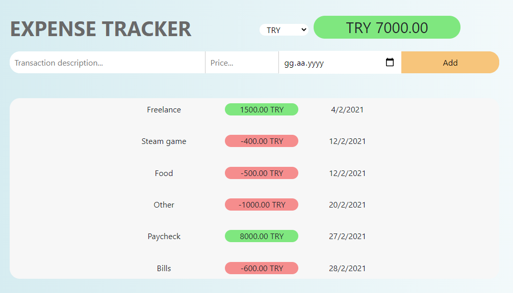
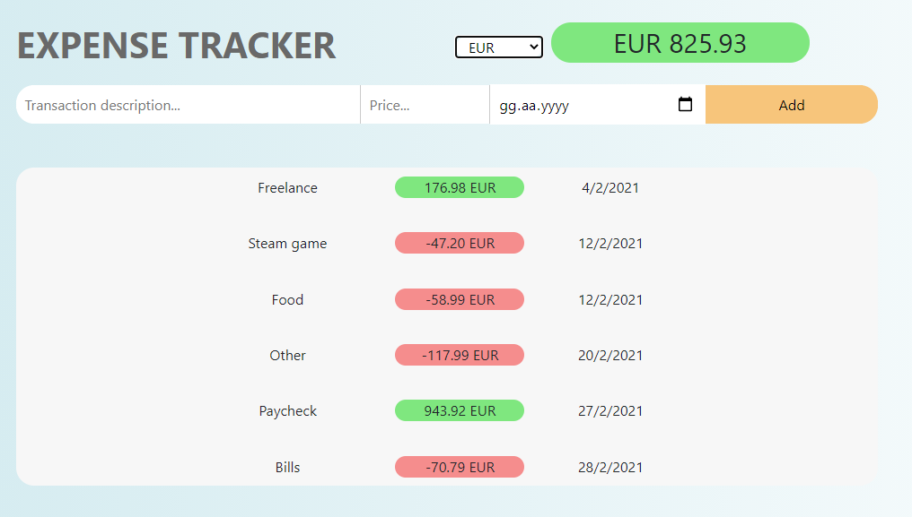

# Expense-Tracker

## About
A web application that lets you track your transaction history using React.js. I used Exchange Rates API to convert from currency to currency. The app has a minimalistic user interface and it’s easy to use.
### Info
Just simply type the description, price and select the date then press Add to add it to transactions list.
You can delete any transaction by hovering over it and clicking on the red X button that appears.
Currency conversion uses Exchange Rates API.

### Screenshots

